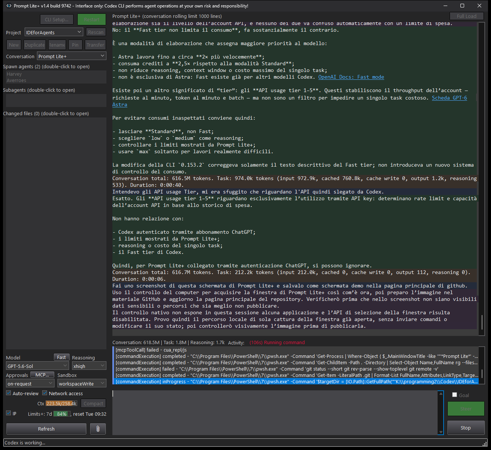

# Prompt Lite+

Documentation and public release version 1.5.
Released 7 September 2026. Windows executable version: 1.5.9746.29740.

Prompt Lite+ is an independent, lightweight Windows interface for a locally
installed Codex CLI `app-server`. It focuses on project directories,
persistent conversations, approvals, tools, diffs, token information, and
low-overhead parallel work.

## Screenshot

Prompt Lite+ is not affiliated with, endorsed by, sponsored by, or supported by
OpenAI. Agent operations are performed by Codex CLI under the permissions
selected by the user. The user is responsible for reviewing and authorizing
those operations and their consequences.

Prompt Lite+ is hobby-developed software provided free of charge and may be
used for any lawful personal or professional purpose. It is not designed,
certified, supported, or warranted for professional, production,
safety-critical, or business-continuity use. Any such use is at the user’s
discretion and risk.

It is designed as a lightweight interface for computers with limited
performance, particularly where the ChatGPT desktop app causes excessive
system load.

## What's new in 1.5

- A gear-button **Config** dialog exposes rolling limits, three conversation
  color presets and **Release/Rolling** update schedules. Checks/downloads run
  in the background; installation still requires an explicit restart.
- Structured asynchronous agent questions are displayed in the conversation.
  **Questions (n)** opens a non-modal reply window with suggested answers and
  free text. Replies can reach an active task without interrupting it.
- Reply drafts remain available until the server accepts the submission.
  Questions and replies are associated with their original conversation.
- Model and reasoning selectors use thread metadata during opening, followed
  by the current server settings. List refreshes do not overwrite local choices.
- Codex CLI 0.153.4 schemas were checked; token accounting remains unchanged.

## Previous 1.4 highlights

- Prompt submission is more reliable, including fast `Ctrl+Enter`, prompt
  clearing, cursor placement, and separation of the first agent response from
  the submitted prompt.
- Conversation block backgrounds are recalculated after window resizing and
  the prompt area expands correctly when no Goal panel is visible.
- Full Load identifies the speaker beside each timestamp, and local file paths
  can be revealed reliably with **Show in Explorer**.
- Additional server rate-limit buckets are preserved under **Limits+** and
  exposed in the existing hint without expanding the interface.
- Pinned conversations remain visible in their normal project list while also
  being placed at the top for quick access.
- Large conversations use summarized cursor-paginated history and a local
  rolling-window cache. The cached view is shown immediately; if server
  metadata has changed, Prompt Lite+ refreshes it in the background. Historical
  tool output and diffs are not downloaded by the normal reload. Full Load uses
  large message-only pages,
  reports progress, and can retain a partial transcript when stopped.
- Project conversations use a compact dropdown and open immediately when
  selected.
- Compatibility has been verified with Codex CLI 0.152.0; its sub-agent and
  spawn-agent protocol structures remain compatible with the current lists.

See [Release Notes](RELEASE_NOTES.md) for development status and release history.

## Download and installation

1. Download [PromptLitePlus-1.5.9746.29740-Win64.zip](https://github.com/SbiriJJ/prompt-lite-plus/releases/download/v1.5/PromptLitePlus-1.5.9746.29740-Win64.zip).
2. Verify the archive against the published SHA-256 checksum.
3. Extract the complete archive into a writable directory.
4. Start `PromptLitePlus.exe`.
5. Read and accept the displayed disclaimer.
6. Use **CLI Setup** to detect, install, or update Codex CLI.
7. Complete Codex CLI authentication when requested.

The archive includes a neutral `PromptLitePlus.ini`. It contains no project
path, thread identifier, download directory, or accepted EULA identity. Prompt
Lite+ updates it locally as the application is used.

Do not run Prompt Lite+ directly from inside the ZIP archive.

## Requirements

- 64-bit Windows;
- Codex CLI 0.152.0 or later, installed and authenticated, or permission to
  install/update it through **CLI Setup**;
- an OpenAI account or subscription supported by Codex CLI.

Codex CLI, OpenAI accounts, models, subscriptions, and services are not
included with Prompt Lite+.

## Documentation

- [End User License Agreement](EULA.md)
- [Legal and Copyright Notice](LEGAL_NOTICE.md)
- [Privacy Notice](PRIVACY.md)
- [Third-Party Notices](THIRD_PARTY_NOTICES.md)
- [User Guide](USER_GUIDE.md)
- [Release Notes](RELEASE_NOTES.md)

## Protocol compatibility

Prompt Lite+ depends on the `app-server` protocol exposed by the installed Codex
CLI. A later Codex CLI release may require a corresponding Prompt Lite+ update.

Prompt Lite+ 1.5 requires Codex CLI 0.152.0 or later. The protocol was checked
against CLI 0.153.4. New asynchronous questions require a CLI/model that emits
them; absent metadata is confirmed through the normal thread resume response.

Prompt Lite+ can be used on the same computer as the ChatGPT desktop app, but
do not use both applications on the same project at the same time.

Official Codex documentation:
[developers.openai.com/codex](https://developers.openai.com/codex/).
